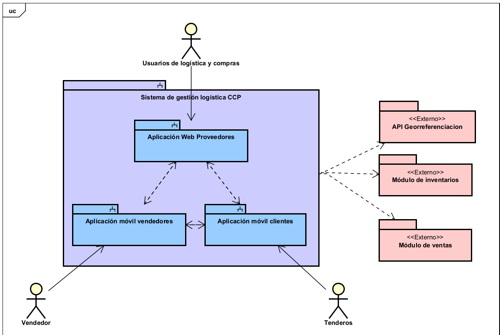
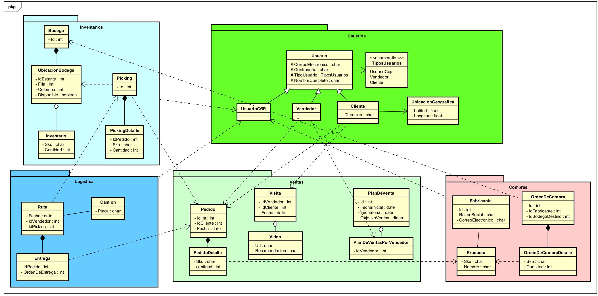
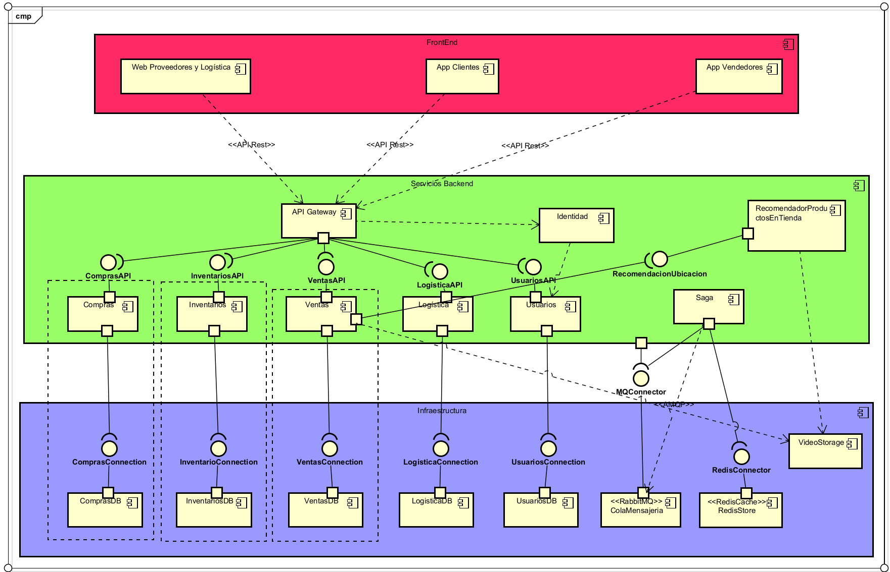

# 2. Arquitectura del sistema

Esta sección presenta los modelos arquitectónicos definidos durante el diseño del sistema, los cuales sirven como base para entender la estructura, componentes y responsabilidades de StoreFlow.

## 2.1 Modelo de contexto

El modelo de contexto representa los límites del sistema y cómo se relaciona con actores externos, tales como fabricantes, clientes, operadores logísticos y sistemas de terceros.

Este modelo permite identificar los flujos de información clave y delimitar qué aspectos serán controlados por la plataforma y cuáles serán integrados o asumidos por otros sistemas.

---

## 2.2 Modelo de dominio

El modelo de dominio muestra los conceptos clave del negocio y sus relaciones. Aquí se definen entidades como Fabricante, Cliente, Producto, Inventario, Visita, entre otros.

---

## 2.3 Modelo de componentes

El sistema está compuesto por una serie de microservicios, cada uno con una responsabilidad clara dentro del dominio de StoreFlow. Estos servicios se comunican entre sí mediante eventos asincrónicos a través de RabbitMQ, y exponen APIs RESTful cuando es necesario.

### Microservicios principales:

- **Usuarios**: Gestión de autenticación, autorización, roles y control de acceso.
- **Inventarios**: Control de stock por bodega, actualización de cantidades, y consulta de disponibilidad.
- **Logística**: Administración de rutas de entrega, asignación de pedidos y estados logísticos.
- **Compras**: Recepción y registro de pedidos de reabastecimiento de productos.
- **Ventas**: Registro de visitas, evidencias (como video), y pedidos realizados por los vendedores.
- **Orquestador de Sagas de Pedidos**: Coordina el flujo de eventos para la gestión de pedidos desde su creación hasta su entrega, asegurando consistencia entre servicios.

### Gateway API

- **API Gateway**: Punto de entrada único que enruta las solicitudes externas a los servicios internos correspondientes. También se encarga de la autenticación, logging y control de tráfico.

Esta estructura permite escalar de forma independiente cada microservicio según la demanda, y facilita la evolución de cada módulo sin impactar directamente a los demás.

---

## 2.4 Patrones arquitectónicos utilizados

- **Arquitectura de microservicios**: Cada servicio es independiente y se despliega de manera autónoma.
- **Event-Driven Architecture**: Se emplea RabbitMQ para la comunicación entre servicios mediante eventos.
- **Kubernetes (AKS)**: Plataforma utilizada para la orquestación y despliegue de contenedores.
- **API Gateway**: Utilizado para el enrutamiento de solicitudes, autenticación centralizada y control de tráfico.

[⬅️ Volver al índice](index.md)