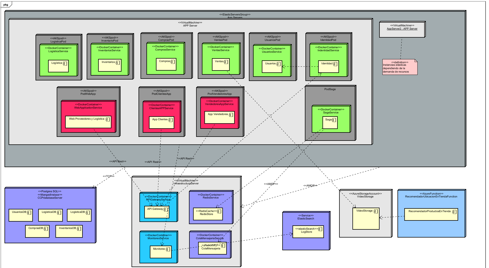

# 3. Infraestructura y despliegue

Esta sección describe cómo se despliega y estructura la infraestructura técnica de StoreFlow, incluyendo los recursos en la nube, contenedores, redes y servicios necesarios para ejecutar el sistema.

## 3.1 Modelo de despliegue

La aplicación está diseñada para ejecutarse en la nube sobre un clúster de Kubernetes (AKS). Cada microservicio se despliega como un `Deployment` independiente, expuesto mediante servicios internos o el API Gateway cuando corresponde.

### Elementos clave:

- **API Gateway**: punto de entrada único a la plataforma.
- **RabbitMQ**: utilizado como broker de eventos para la comunicación asincrónica entre microservicios.
- **PostgreSQL**: almacenamiento relacional dedicado por servicio.
- **Blob Storage**: almacenamiento de archivos multimedia como videos.
- **OpenTelemetry + Aspire Dashboard**: recolección y visualización de métricas y trazas distribuidas.

---

## 3.2 Restricciones técnicas

Para garantizar compatibilidad, escalabilidad y facilidad de mantenimiento, el diseño contempla las siguientes restricciones técnicas:

1. La aplicación debe constar de:
   - Una **aplicación web** para proveedores y logística.
   - Una **aplicación móvil para vendedores**.
   - Una **aplicación móvil para clientes**.

2. El sistema debe desplegarse en un **proveedor de nube pública** (actualmente: **Azure**).

3. El diseño debe permitir **futura integración con sistemas externos**, sin requerir modificaciones estructurales significativas.

4. Las **aplicaciones móviles deben ser compatibles con dispositivos de gama media y baja**, garantizando accesibilidad.

5. El acceso a la aplicación web debe estar optimizado para navegadores modernos (Chrome, Edge, Firefox).

---

## 3.3 Estrategia de despliegue y orquestación

- El ciclo de despliegue se realiza mediante **pipelines CI/CD** configurados en GitHub Actions.
- Se emplea **Terraform** para la creación de infraestructura como código.
- Cada microservicio puede escalar horizontalmente de manera independiente.
- **Toda la comunicación entre microservicios se realiza de forma asincrónica a través de RabbitMQ.**
- Se utiliza **Aspire Dashboard** para visualizar las métricas y trazas recolectadas con OpenTelemetry.

[⬅️ Volver al índice](index.md)