# Guía paso a paso para el uso de StoreFlow

A continuación se detallan las acciones principales que pueden realizar los usuarios del sistema StoreFlow, organizadas por perfil.

---

## 👩‍💼 Administrador (Web)

### 1. Registrar un fabricante individual
1. Inicia sesión como administrador.
2. Dirígete al módulo **Fabricantes**.
3. Haz clic en "Registrar nuevo fabricante".
4. Completa los campos obligatorios: nombre, correo, teléfono.
5. Guarda el registro.
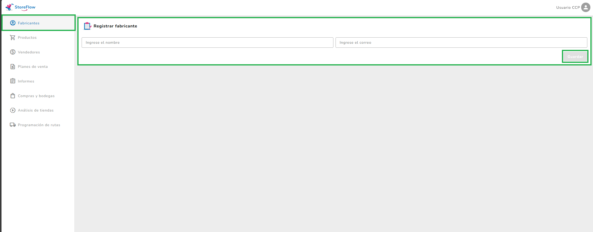

---

### 2. Registrar productos masivamente (CSV)
1. Ve al módulo **Productos**.
2. Haz clic en "Carga masiva".
4. Carga el archivo CSV  completo.
5. Visualiza el resumen de productos cargados y errores.
.png)

---

### 3. Registrar una compra
1. Accede al módulo **Compras**.
2. Selecciona el fabricante.
3. Elige los productos y cantidades.
4. Asigna una bodega de destino.
5. Confirma la compra.
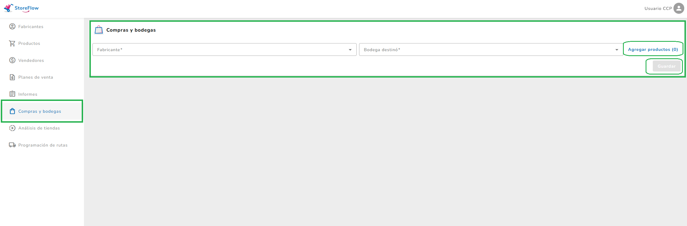

---

### 4. Registrar un vendedor
1. Accede al módulo **Vendedores**.
2. llena los campos correspondientes y guarda
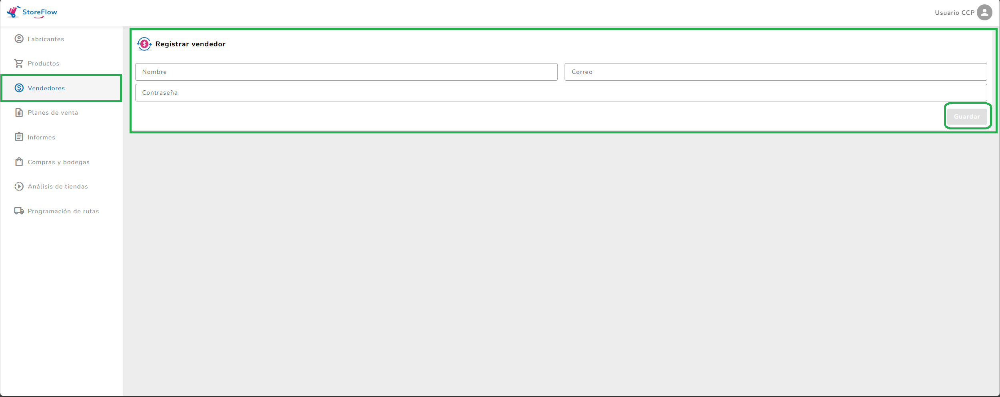

---

### 5. Asignar plan de venta
1. En el módulo **Planes de venta**, crea un nuevo plan.
2. Asigna metas por vendedor.
3. Guarda el plan.
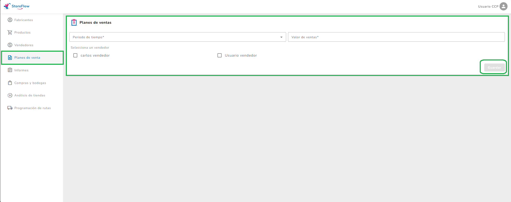

---
### 6. Visualizar informe
1. En el modulo **informes**,selecciona un vendedor
2. Selecciona lo filtros y consulta
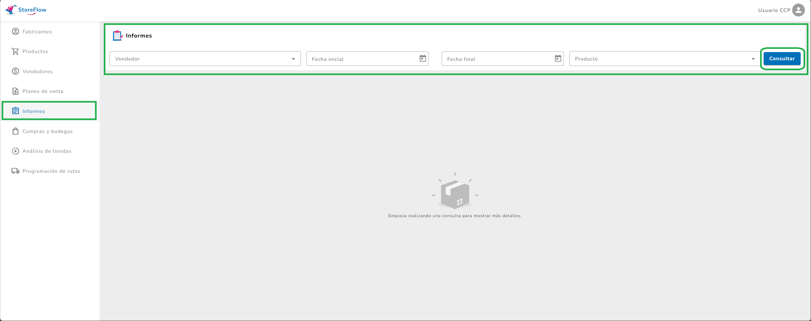
---

### 7.Análisis de tiendas
1. Entra al módulo **Análisis de tiendas**.
2. Selecciona una visita registrada.
3. Visualiza el video subido y las recomendaciones generadas.
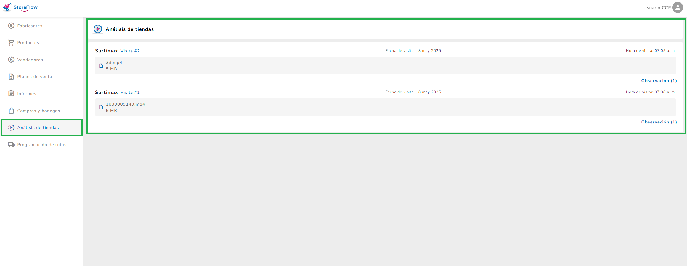

---

## 🧑‍🦱 Vendedor (App móvil)

### 1. Ver rutas asignadas
1. Abre la app e inicia sesión.
2. Dirígete a la sección de rutas.
3. Consulta las tiendas asignadas para el día.
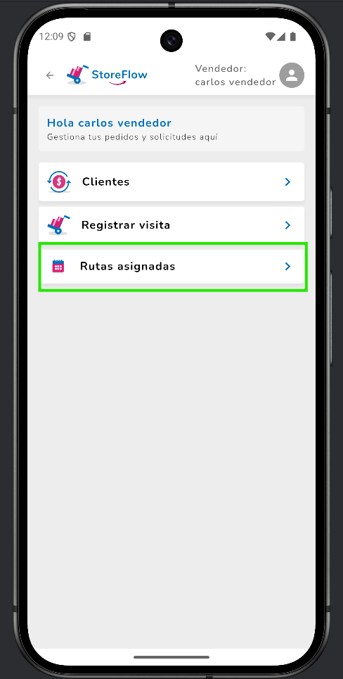
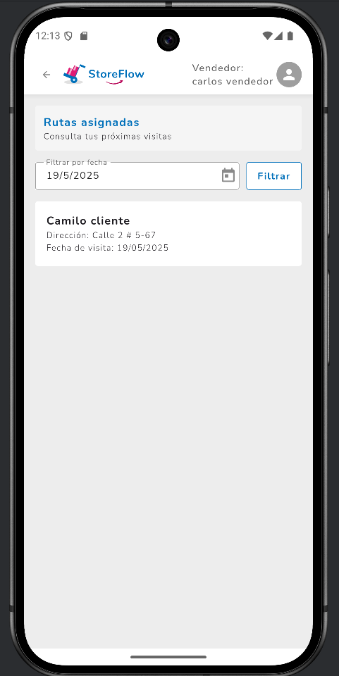

---

### 2. Registrar visita
1. Selecciona la tienda a visitar.
2. Inicia la visita desde la app.
3. Graba el video y adjúntalo.
4. Guarda la visita.

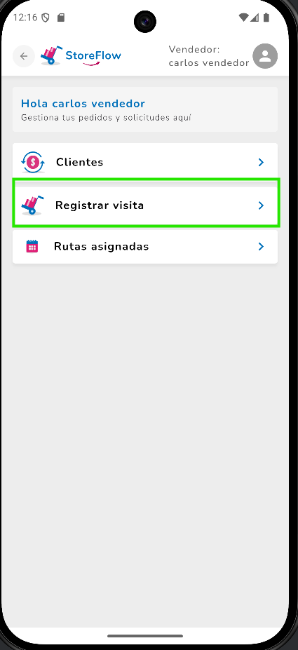
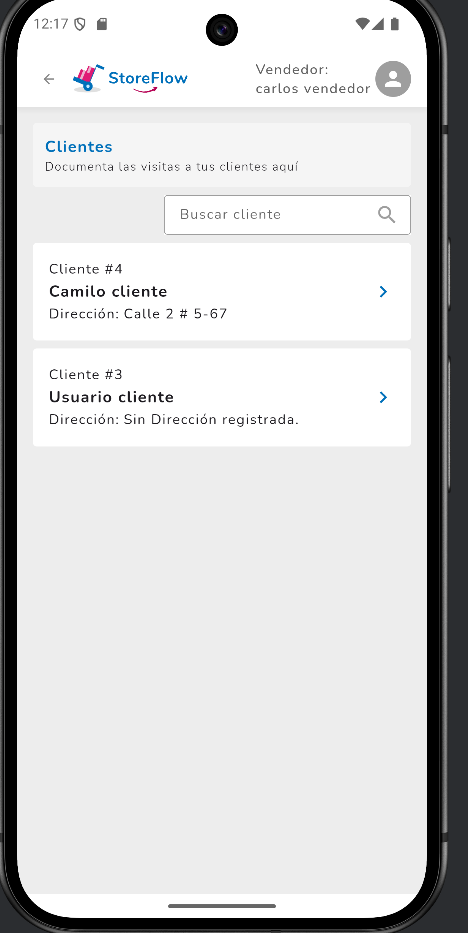
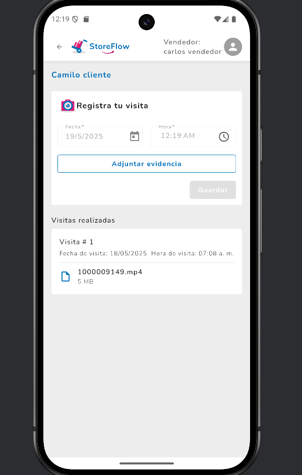

---

### 3. Registrar pedido
1. Entra a la opcion "Clientes" selecciona el cliente 
2. Agrega los productos y cantidades.
3. Confirma el pedido.
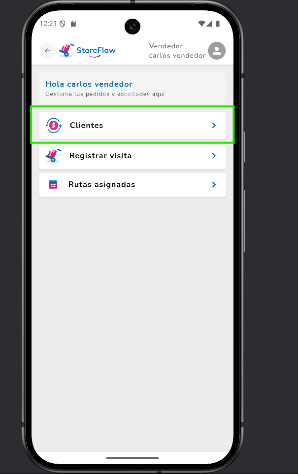
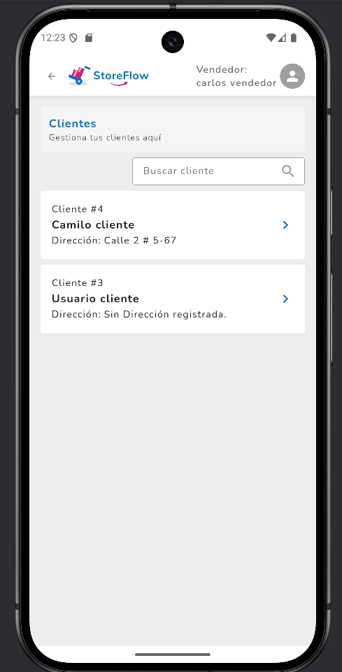

---

## 🧍 Cliente (App móvil)

### 1. Registrarse
1. Abre la app y selecciona "Crear cuenta".
2. Llena los campos de nombre, correo y contraseña.
3. Envía el formulario y espera confirmación.
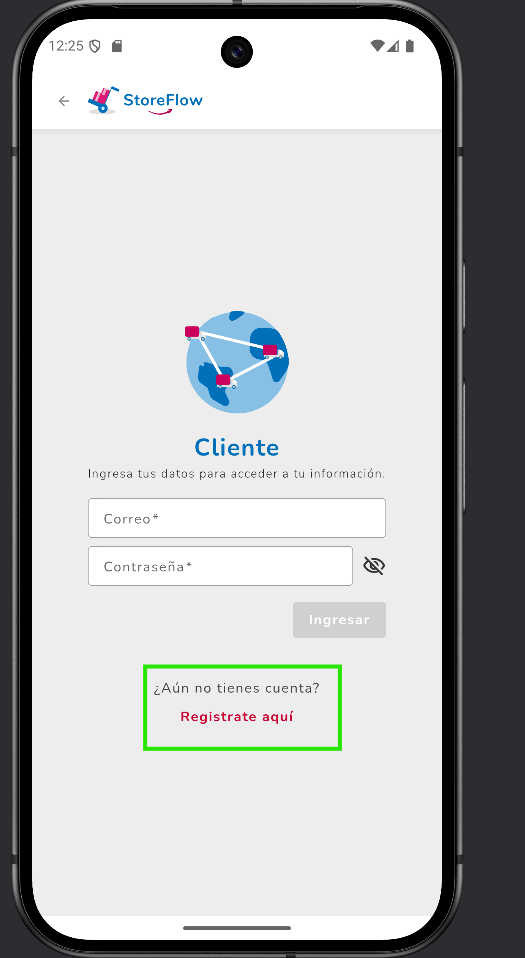
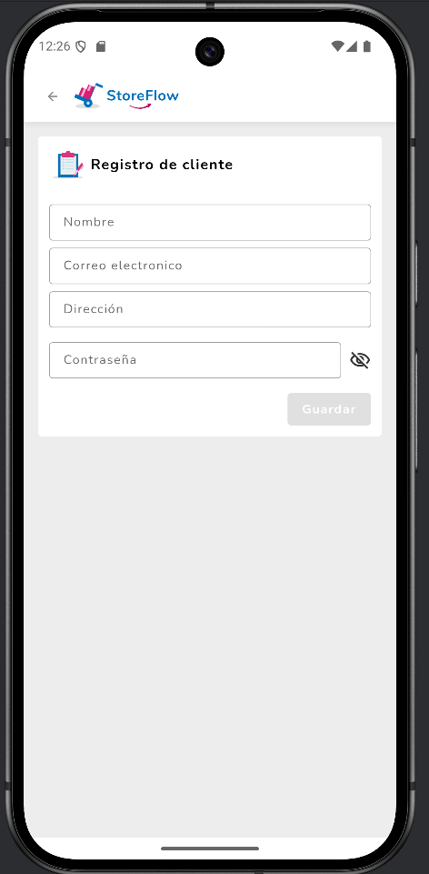

---

### 2. Iniciar sesión
1. Desde la pantalla inicial, ingresa tus credenciales.
2. Presiona "Iniciar sesión".
3. Accede al panel principal de la app.
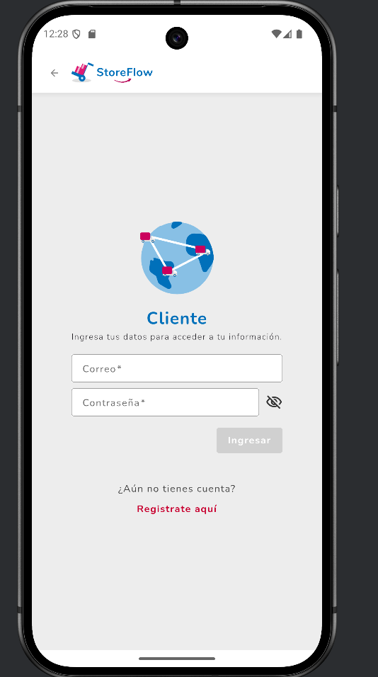

---

### 3. Crear pedido
1. En el menú principal, selecciona "Nuevo pedido".
2. Agrega productos al carrito.
3. Revisa el resumen y confirma.
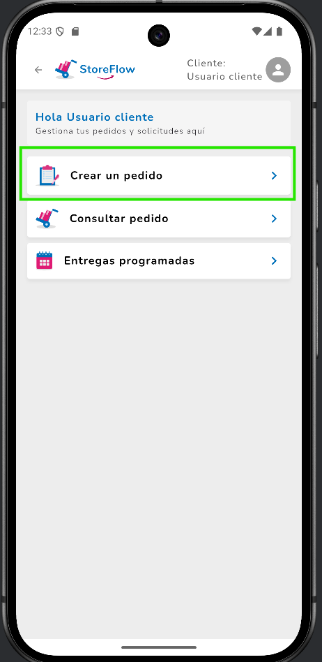
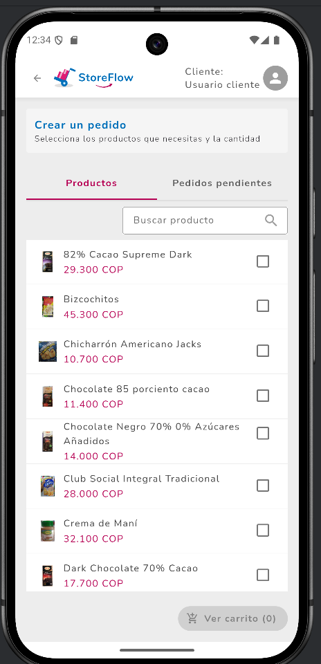

[⬅️ Volver al índice](index.md)